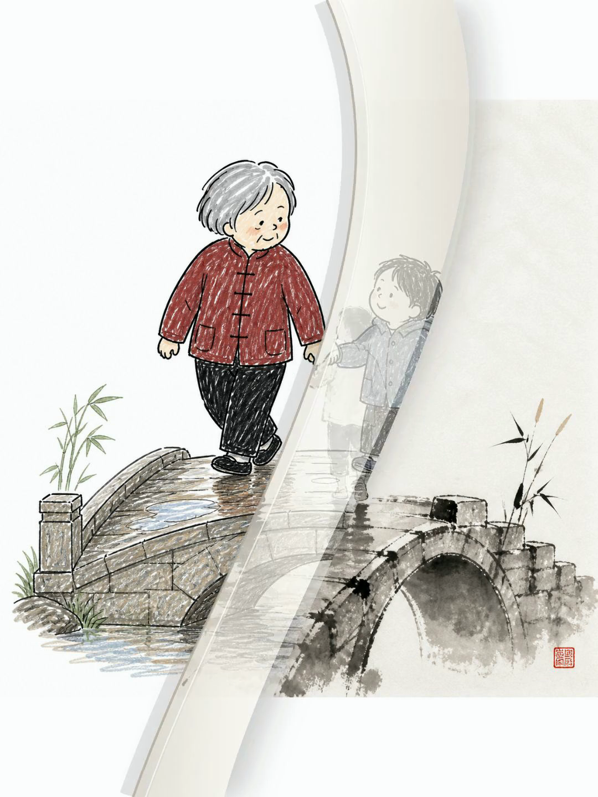
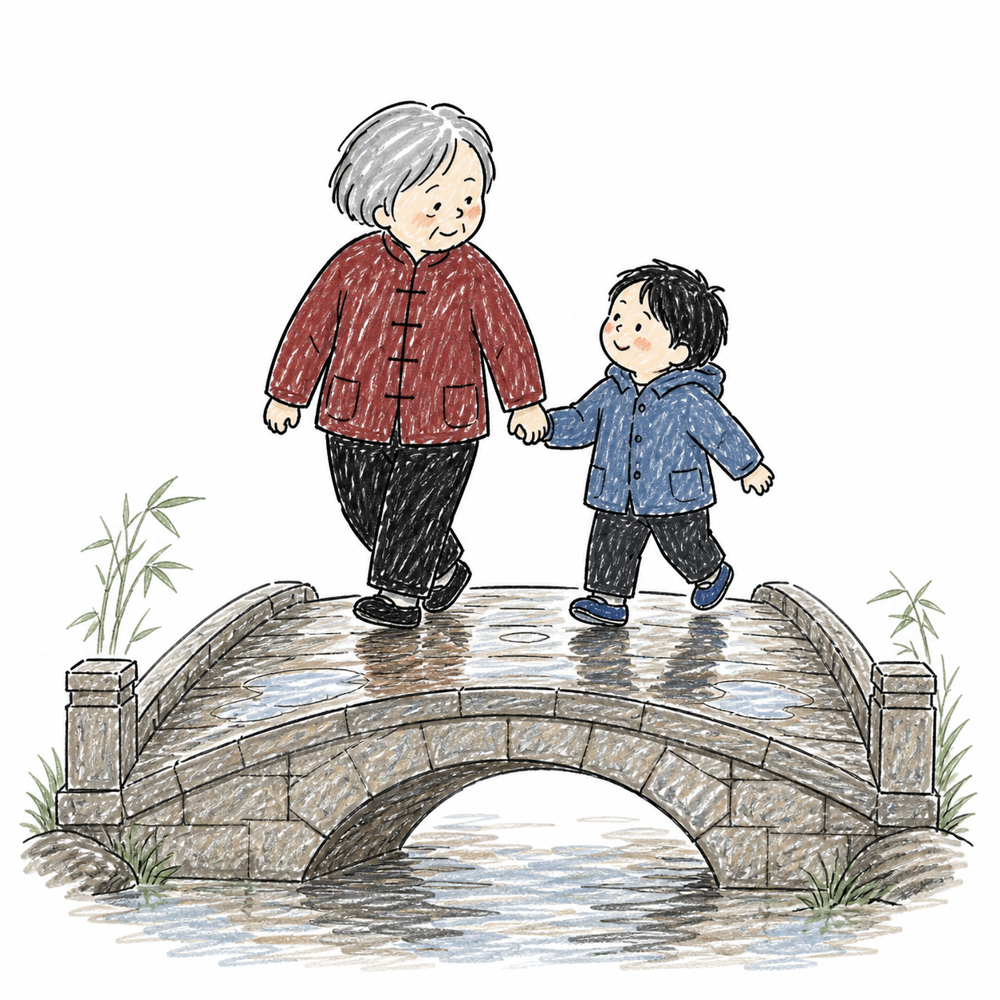
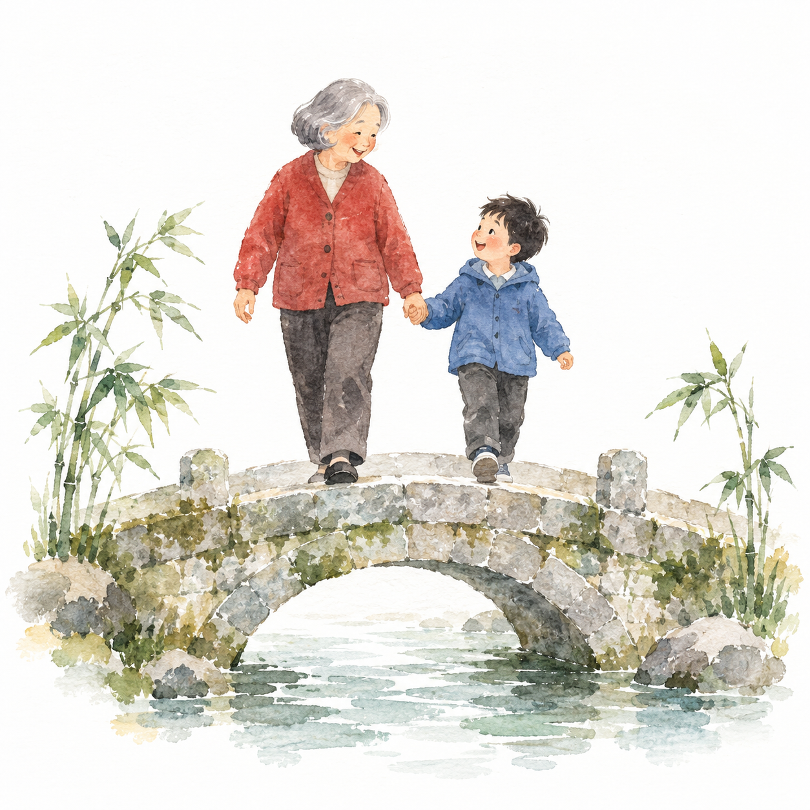

# story-to-handdrawn-video

把中文故事或有序图片，做成 **3:4 竖屏、静音、可后期配音的手绘动画**。

默认由 Agent 的生图工具同时绘制插画和准确的手写中文字，再制作「文字 → 黑白画稿 → 彩色插画」动画；也可以保留整页，使用右下角卷页翻书效果。

**[浏览 327 项本地资产](references/style-library.html)** · [安装与使用](#快速开始) · [参考图风格](#用参考图生成并收藏风格) · [配图回测](examples/standard-preview-report.md) · [视频回测](examples/replay-report.md) · [English](#english)

## 45 秒翻书演示

[](https://github.com/gnipbao/story-to-handdrawn-video/raw/refs/heads/main/examples/style-showcase/handdrawn-styles-75-page-flip-45s-bgm.mp4)

**[观看 / 下载配乐演示（MP4，约 20 MB）](https://github.com/gnipbao/story-to-handdrawn-video/raw/refs/heads/main/examples/style-showcase/handdrawn-styles-75-page-flip-45s-bgm.mp4)** · [风格顺序与制作说明](examples/style-showcase/README.md)

从内置资产中选择 75 种风格，覆盖 11 类，按不同画材交错安排，以右下角卷页展示同一个过桥场景。成片为 45 秒、1080×1440、30 fps；BGM 在静音成片完成后添加，音乐署名见 [演示许可](examples/style-showcase/BGM_CREDITS.md)。

## 先选一个画风

内置 **297 条画风配方 + 30 种主题配色**，全部附本地示意图。默认展示 30 种常用精选，可按画材、类型、名称或编号筛选，点击图片查看大图。下载仓库后直接打开 `references/style-library.html`，无需启动服务或联网。

| 彩铅日记漫画 · 默认 | 四季旅行水彩 · HS-128 | 肌理剪纸拼贴 · HS-225 | 主题配色 · C-01 |
| :---: | :---: | :---: | :---: |
| [](references/style-examples/standard/colored-pencil-diary.png) | [](references/style-examples/standard/hs-128.png) | [](references/style-examples/standard/hs-225.png) | [](references/style-examples/standard/c-01.png) |

所有配图使用同一个标准场景：**老人和小孩牵手走过石拱桥**。统一人物关系、左右位置、石桥与留白，画材、造型、细节和配色随风格变化，方便直接比较。30 种精选按常见用途选编，全部画风与配色可在 [资产库说明](references/style-library-guide.md) 中查询。

## 快速开始

本仓库同时提供 **Remotion 渲染器**和可安装的 **Agent Skill**。需要 Node.js 20+、Python 3.10+、FFmpeg（含 `ffprobe`）、npm，以及 Chrome 或 Remotion 支持的浏览器。生成新图需要 Agent 可调用的生图工具；“本地工具”表示从当前 Agent 调用，不表示模型离线运行。

```bash
git clone https://github.com/gnipbao/story-to-handdrawn-video.git
cd story-to-handdrawn-video
npm ci
npm run check

# 安装到 Codex；其他 Agent 请使用其实际 skills 目录
cp -R skill-package/story-to-handdrawn-video ~/.codex/skills/

# 在项目外调用时，指定渲染器位置
export STORY_VIDEO_PROJECT=/absolute/path/to/story-to-handdrawn-video
```

然后在 Agent 中输入：

```text
使用 $story-to-handdrawn-video，把下面的故事生成手绘动画，先给我预览版：
小猫坐在窗边。小鸟停在枝头。
```

Agent 会规划分镜、生成角色参考和每页母图、检查中文字、导入素材并渲染。未指定画风时，继续使用已锁定的「彩铅日记漫画」。默认不使用站酷马善政字体；文字本身就是生图工具绘制的画面资产。

## 三种使用方式

### 故事生成视频

```text
使用 $story-to-handdrawn-video，把 /absolute/story.txt 做成手绘动画。
选择 HS-128 四季旅行水彩，标题叫“纸上的夏天”，先出预览。
```

支持指定内置 ID、原有 1–20 编号、唯一名称或别名；新增风格用 `HS-001` 至 `HS-277`，配色用 `C-01` 至 `C-30`。故事原文保留，每个完整句子默认一个节拍。需要翻页时直接说“使用翻书效果”。

### 已有图片生成视频

```text
使用 $story-to-handdrawn-video，按顺序把这些图片做成翻书动画：
/absolute/01.jpg /absolute/02.jpg /absolute/03.jpg
```

选择逐层绘制效果时，系统识别上方文字和下方插画，从彩色图派生对齐的黑白层。选择翻页时，完整保留母图及原文字，不拆分、不重新绘字。生成图片也遵循同一套处理原则。

### 用参考图生成并收藏风格

```text
使用 $story-to-handdrawn-video，参考这张图的画风生成下面的故事。
请把这个风格收藏为“旅行水彩”，方便以后使用。
```

Agent 看图解析线条、造型、配色、材质、构图和手写字特征，用这些特征绘制新故事。参考图里的原人物、原文字不会自动成为故事内容。提出收藏后，参考图和风格描述保存到项目 `.story-video/styles/`；后续可按名字或 `custom:<id>` 复用。个人风格不会进入公共目录或分享包。

纯 CLI 会准备视觉分析请求，不能自行看图；需要 Agent 完成分析后继续。格式与保存规则见 [参考图工作流](skill-package/story-to-handdrawn-video/references/reference-style-workflow.md)。

## 命令行入口

统一入口为 `scripts/run_story_video.py`；在 Agent 中使用 Skill 时无需手动执行这些步骤。

```bash
# 默认 30 项、全部画风、分类与配色
python3 scripts/run_story_video.py --list-styles
python3 scripts/run_story_video.py --list-styles --all-styles
python3 scripts/run_story_video.py --list-styles --category watercolor
python3 scripts/run_story_video.py --list-styles --asset-type palette

# 生成任务清单：下一步由 Agent 调用真实生图工具
python3 scripts/run_story_video.py \
  --input examples/story.txt --style HS-128 --palette C-01 --mode generate

# 母图生成并检查完毕后，导入并出预览
python3 scripts/run_story_video.py --mode import
python3 scripts/run_story_video.py --mode preview

# 上传图片可直接导入并渲染
python3 scripts/run_story_video.py \
  --images /absolute/01.jpg /absolute/02.jpg --transition page-flip --mode preview
```

`--mode plan` 只规划；`--mode generate` 在默认 Codex 路径中只准备生图任务，尚未产出图片或视频。`--generator api` 仅在明确选择并配置 `OPENAI_API_KEY` 时使用。只有明确需要排版字体时才选择 `--text-mode font`，该模式使用系统字体且仅支持直接切换。

## 成片与质量检查

| 输入 | 720×960 预览 | 1080×1440 正式成片 |
| --- | --- | --- |
| 故事文本 | `out/picture_silent-preview.mp4` | `out/picture_silent.mp4` |
| 上传图片 | `out/uploaded_picture_silent-preview.mp4` | `out/uploaded_picture_silent.mp4` |

输出为 30 fps、H.264 静音 MP4。默认不生成配音或音乐，供后期剪辑使用。

每张母图需检查中文字、角色连续性和四周留白。裁切按实际文字与插画的分隔识别；模型未严格遵守提示中的像素位置时，不机械沿固定坐标切图。无法可靠分离的生成母图需要修图或重生成。详见 [素材处理规则](skill-package/story-to-handdrawn-video/references/asset-workflow.md)。

```bash
npm run check              # 类型、资产库可复现性、流程测试、历史分镜结构
npm run build              # Remotion 生产构建
npm run check:storyboard   # 严格验证当前分镜引用的真实素材
npm run styles:build       # 从固定数据与本地图片重建资产库及目录
npm run dev                # Remotion Studio
npm run package:share      # 校验后打包源码、Skill、内置图库与许可
```

新检出的仓库不包含历史生成素材，所以 `check:storyboard` 需要先导入当前项目的图片；每个渲染命令也会自动执行对应素材校验。自动化测试使用隔离样本，视觉质量通过真实生图和成片回看单独验证：[327 项标准配图回测](examples/standard-preview-report.md)、[手写文字与视频回测](examples/replay-report.md)、[维护回测提示词](examples/regression-prompts.md)。

## 项目结构

| 路径 | 用途 |
| --- | --- |
| [`skill-package/story-to-handdrawn-video/`](skill-package/story-to-handdrawn-video/SKILL.md) | Skill 行为约定、便携入口与按需加载说明 |
| [`src/`](src/) | Remotion 场景、擦除动效、翻页组件 |
| [`scripts/`](scripts/) | 分镜、风格查询、导入、校验、打包 |
| [`references/style-library.html`](references/style-library.html) | 离线风格目录 |
| [`references/handdrawn-style-library.json`](references/handdrawn-style-library.json) | 机器可读的 327 项资产 |
| [`references/style-examples/`](references/style-examples/) | 全部本地示意图 |
| [`examples/`](examples/) | 示例故事、维护用例与回测记录 |
| `.story-video/`、`out/` | 私有风格及本地输出，不进入源码分享包 |

## English

Turn Chinese stories or ordered local pages into silent, vertical hand-drawn videos with Remotion. The default workflow generates exact handwritten captions together with the art, then reveals text, locally derived grayscale art, and color. Page flips preserve the complete original page.

The offline library includes **297 style recipes and 30 palettes**, all with local previews, plus a curated 30-style default menu. Reference images can be analyzed by the Agent and saved privately for reuse. Every preview uses the same grandmother-and-child bridge scene, generated for this project so that styles and palettes can be compared consistently.

Watch the [45-second page-flip showcase](https://github.com/gnipbao/story-to-handdrawn-video/raw/refs/heads/main/examples/style-showcase/handdrawn-styles-75-page-flip-45s-bgm.mp4): 75 styles across 11 categories at 1080×1440 / 30 fps. Background music was added in post-production; see the [music credit](examples/style-showcase/BGM_CREDITS.md).

Install the renderer with `npm ci`, copy `skill-package/story-to-handdrawn-video` to your Agent's skills directory, and set `STORY_VIDEO_PROJECT` if needed. Ask the Skill to generate a preview from a story or ordered images. Exports are silent H.264 at 720×960 or 1080×1440. See the [Skill](skill-package/story-to-handdrawn-video/SKILL.md), [offline catalog](references/style-library.html), and [retest report](examples/replay-report.md) for workflow details and verified scope.

## 参考与许可

画风整理参考 [handraw-style](https://github.com/yang0/handraw-style) 与 [hand-drawn-styles](https://github.com/threerocks/hand-drawn-styles)。标准配图由本项目统一生成。代码采用 [MIT](LICENSE)，相关文字资料的署名和许可保留于 [扩展资料许可](references/vendor/yang0-handraw-style/LICENSE) 与 [原有资料许可](references/handdrawn-styles-LICENSE.txt)。
