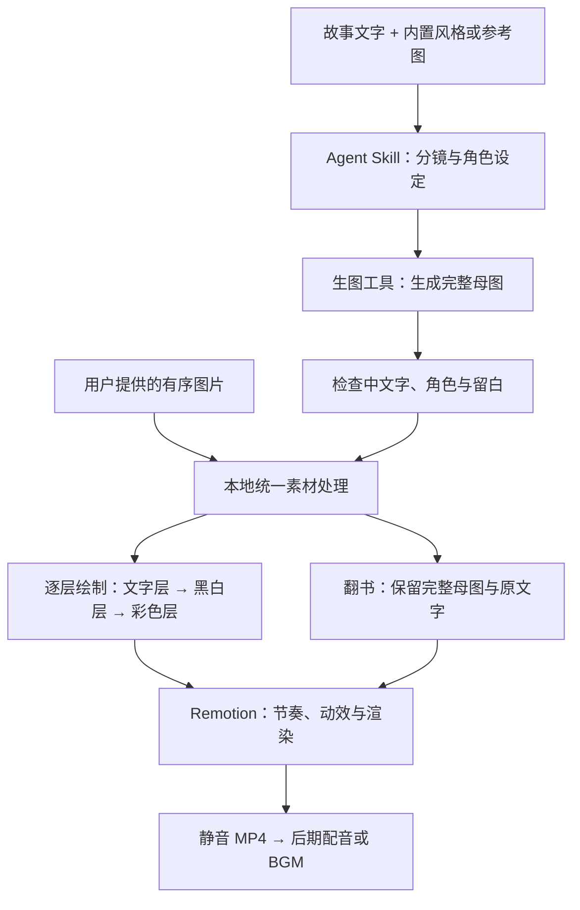

# story-to-handdrawn-video

把中文故事或有序图片，做成 **3:4 竖屏、可后期配音的手绘动画**。用自然语言驱动 Agent Skill，完成分镜、插画生成、素材处理和 Remotion 渲染。

默认由 Agent 的生图工具同时绘制插画和准确的手写中文字，再制作「文字 → 黑白画稿 → 彩色插画」动画；也可以保留整页，使用右下角卷页翻书效果。

**[在线风格库](https://story-handdrawn-style-library.vercel.app)** · [快速开始](#快速开始) · [项目原理](#项目原理) · [English](#english)

## 45 秒翻书演示

<!-- showcase-preview:start -->
https://github.com/user-attachments/assets/9c7ebd73-16fe-4428-8d2c-99006469b201
<!-- showcase-preview:end -->

**[播放完整视频](https://story-handdrawn-style-library.vercel.app/demo/)** · [下载 MP4（约 20 MB）](https://github.com/gnipbao/story-to-handdrawn-video/raw/refs/heads/main/examples/style-showcase/handdrawn-styles-75-page-flip-45s-bgm.mp4) · [风格顺序与制作说明](examples/style-showcase/README.md)

从内置资产中选择 75 种风格，覆盖 11 类，按不同画材交错安排，以右下角卷页展示同一个过桥场景。成片为 45 秒、1080×1440、30 fps；BGM 在静音成片完成后添加，音乐署名见 [演示许可](examples/style-showcase/BGM_CREDITS.md)。

## 这次更新了什么

- **327 项风格资产**：保留原有 20 种风格，扩展到 297 条画风配方与 30 种主题配色；默认展示 30 种常用精选，按 11 类画材与表现方式浏览。
- **参考图制作新故事**：Agent 解析参考图的线条、造型、配色和材质，用同一套视觉语言生成新的分镜。
- **自己的风格库**：把满意的参考图风格命名收藏，下次直接调用，私有资产保存在本地项目中。
- **手绘文字与插画统一生成**：默认将手写中文字绘入母图；生成图片与上传图片使用同一套后期处理，再选择逐层绘制或整页翻书。

## 先选一个画风

打开 **[在线风格库](https://story-handdrawn-style-library.vercel.app)**，按画材、类型、名称或编号筛选，点击图片查看大图。全部资产都有项目内置示意图；下载仓库后也可以直接打开 `references/style-library.html` 离线浏览，无需启动服务。

| 彩铅日记漫画 · 默认 | 四季旅行水彩 · HS-128 | 肌理剪纸拼贴 · HS-225 | 主题配色 · C-01 |
| :---: | :---: | :---: | :---: |
| [](references/style-examples/standard/colored-pencil-diary.png) | [](references/style-examples/standard/hs-128.png) | [](references/style-examples/standard/hs-225.png) | [](references/style-examples/standard/c-01.png) |

所有配图使用同一个标准场景：**老人和小孩牵手走过石拱桥**。统一人物关系、左右位置、石桥与留白，画材、造型、细节和配色随风格变化，方便直接比较。这些人物与场景只用于风格对比，生成视频时以你的故事和角色设定为准。30 种精选按常见用途选编，全部画风与配色可在 [资产库说明](references/style-library-guide.md) 中查询。

## 快速开始

本仓库同时提供 **Remotion 渲染器**和可安装的 **Agent Skill**：渲染器负责实际处理与导出，Skill 让 Codex、Claude Code、Kimi Code 等支持 Skill 的 Agent 用自然语言调用这些能力。

环境需要 Node.js 20+、Python 3.10+、FFmpeg（含 `ffprobe`）、npm，以及 Chrome 或 Remotion 支持的浏览器。生成新图还需要 Agent 可调用的生图工具；“本地工具”表示从当前 Agent 调用，不表示模型离线运行。

先安装渲染器：

```bash
git clone https://github.com/gnipbao/story-to-handdrawn-video.git
cd story-to-handdrawn-video
npm ci
npm run check
```

再按所用 Agent 安装 Skill，选择对应的一条命令：

```bash
# Codex
cp -R skill-package/story-to-handdrawn-video ~/.codex/skills/

# Claude Code
cp -R skill-package/story-to-handdrawn-video ~/.claude/skills/

# Kimi Code / 使用通用 skills 目录的 Agent
cp -R skill-package/story-to-handdrawn-video ~/.agents/skills/
```

其他 Agent 使用各自支持的 skills 目录。在渲染器项目之外调用时，设置项目位置：

```bash
export STORY_VIDEO_PROJECT=/absolute/path/to/story-to-handdrawn-video
```

然后在 Agent 中输入：

```text
使用 $story-to-handdrawn-video，把下面的故事生成手绘动画，先给我预览版：
小猫坐在窗边。小鸟停在枝头。
```

Agent 会规划分镜、生成角色参考和每页母图、检查中文字、导入素材并渲染。未指定画风时，继续使用已锁定的「彩铅日记漫画」。默认文字由生图工具绘制，与插画一起成为画面资产。

## 三种使用方式

### 故事生成视频

```text
使用 $story-to-handdrawn-video，把 /absolute/story.txt 做成手绘动画。
选择 HS-128 四季旅行水彩，标题叫“纸上的夏天”，先出预览。
```

支持指定内置 ID、原有 1–20 编号、唯一名称或别名；新增风格用 `HS-001` 至 `HS-277`，配色用 `C-01` 至 `C-30`。故事原文保留，每个完整句子默认一个节拍。需要翻页时直接说“使用翻书效果”。

### 已有图片生成视频

```text
使用 $story-to-handdrawn-video，按顺序把这些图片做成翻书动画：
/absolute/01.jpg /absolute/02.jpg /absolute/03.jpg
```

选择逐层绘制效果时，系统识别上方文字和下方插画，从彩色图派生对齐的黑白层。选择翻页时，完整保留母图及原文字，不拆分、不重新绘字。生成图片也遵循同一套处理原则。

### 用参考图生成并收藏风格

```text
使用 $story-to-handdrawn-video，参考这张图的画风生成下面的故事。
请把这个风格收藏为“旅行水彩”，方便以后使用。
```

Agent 看图解析线条、造型、配色、材质、构图和手写字特征，用这些特征绘制新故事。参考图里的原人物、原文字不会自动成为故事内容。提出收藏后，参考图和风格描述保存到项目 `.story-video/styles/`；后续可按名字或 `custom:<id>` 复用。个人风格不会进入公共目录或分享包。

纯 CLI 会准备视觉分析请求，不能自行看图；需要 Agent 完成分析后继续。格式与保存规则见 [参考图工作流](skill-package/story-to-handdrawn-video/references/reference-style-workflow.md)。

## 项目原理

项目把生成图片与制作动画分开处理。Agent 负责理解故事和画风、调用生图工具；本地脚本从已经确认的母图派生素材；Remotion 按分镜播放图层并导出视频。母图是每页完整的「手写文字 + 插画」，已有图片也可以直接作为母图输入。



### 两种动画方式

| | 逐层绘制 | 翻书效果 |
| --- | --- | --- |
| 素材 | 按页面实际布局拆出文字和插画，再从彩色插画本地派生黑白层 | 完整母图直接作为一页 |
| 动作 | 文字 → 黑白画稿 → 彩色插画，从左到右依次揭示 | 静态展示当前页，从右下角卷起并露出下一页 |
| 保留内容 | 文字保留为图片，黑白与彩色层使用同一构图 | 保留原画面、原文字与原配色，纸背带有淡化的原页纹理 |
| 适合 | 讲故事、知识讲解、需要逐步出现的内容 | 绘本、漫画页、风格展示、已经排版好的整页图片 |

逐层绘制是对已有图层的动画揭示，黑白层由最终彩色图转换得到，保证位置对齐；它不依赖再次生图，也不是逐笔模拟画师的笔迹。翻书模式没有额外的文字重绘或黑白阶段。

### 保持角色、文字与构图一致

故事按完整句子组织节拍，保留原文措辞。时间跳跃、指代不明或角色年龄变化先进入视觉规划，再生成角色参考和分镜。角色参考控制人物身份，画风配方控制线条、材质和色板，两者分别管理。

生成页和上传页共用 `scripts/page-assets.mjs`，按实际内容边界处理文字区与插画区，使用等比缩放和留白适配画布；画面采用 `contain`，避免铺满裁切。切换画风、参考图或配色会改变素材指纹，防止误用上一批图片。更具体的画布、图层和素材约定见 [DESIGN.md](DESIGN.md)。

## 命令行入口

统一入口为 `scripts/run_story_video.py`；在 Agent 中使用 Skill 时无需手动执行这些步骤。

```bash
# 默认 30 项、全部画风、分类与配色
python3 scripts/run_story_video.py --list-styles
python3 scripts/run_story_video.py --list-styles --all-styles
python3 scripts/run_story_video.py --list-styles --category watercolor
python3 scripts/run_story_video.py --list-styles --asset-type palette

# 生成任务清单：下一步由 Agent 调用真实生图工具
python3 scripts/run_story_video.py \
  --input examples/story.txt --style HS-128 --palette C-01 --mode generate

# 母图生成并检查完毕后，导入并出预览
python3 scripts/run_story_video.py --mode import
python3 scripts/run_story_video.py --mode preview

# 确认预览后导出正式成片
python3 scripts/run_story_video.py --mode render

# 上传图片可直接导入并渲染
python3 scripts/run_story_video.py \
  --images /absolute/01.jpg /absolute/02.jpg --transition page-flip --mode preview
```

`--mode plan` 只规划；`--mode generate` 在默认 Codex 路径中只准备生图任务，尚未产出图片或视频。`--generator api` 仅在明确选择并配置 `OPENAI_API_KEY` 时使用。只有明确需要排版字体时才选择 `--text-mode font`，该模式使用系统字体且仅支持直接切换。

## 成片输出

| 输入 | 720×960 预览 | 1080×1440 正式成片 |
| --- | --- | --- |
| 故事文本 | `out/picture_silent-preview.mp4` | `out/picture_silent.mp4` |
| 上传图片 | `out/uploaded_picture_silent-preview.mp4` | `out/uploaded_picture_silent.mp4` |

输出为 3:4、30 fps、H.264 静音 MP4。默认不生成配音或音乐，供后期剪辑使用；本页演示的 BGM 是在静音成片完成后添加的。使用上传图片时，以 `--mode full` 导出正式成片。

## 开发与维护

每张母图需检查中文字、角色连续性和四周留白。裁切按实际文字与插画的分隔识别；模型未严格遵守提示中的像素位置时，不机械沿固定坐标切图。无法可靠分离的生成母图需要修图或重生成。详见 [素材处理规则](skill-package/story-to-handdrawn-video/references/asset-workflow.md)。

```bash
npm run check              # 类型、资产库可复现性、流程测试、历史分镜结构
npm run build              # Remotion 生产构建
npm run check:storyboard   # 严格验证当前分镜引用的真实素材
npm run styles:build       # 从固定数据与本地图片重建资产库及目录
npm run site:build         # 构建可独立部署到 Vercel 的静态图库
npm run dev                # Remotion Studio
npm run package:share      # 校验后打包源码、Skill、内置图库与许可
```

新检出的仓库不包含历史生成素材，所以 `check:storyboard` 需要先导入当前项目的图片；每个渲染命令也会自动执行对应素材校验。自动化测试使用隔离样本，视觉质量通过真实生图和成片回看单独验证：[327 项标准配图回测](examples/standard-preview-report.md)、[手写文字与视频回测](examples/replay-report.md)、[维护回测提示词](examples/regression-prompts.md)。

在线图库独立部署为静态网站，提供轻量图片、分类搜索和视频播放器；构建与部署方法见 [站点说明](site/README.md)。离线图库和原始配图继续随项目提供。

欢迎提交改进与使用反馈。修改渲染行为时，请同步更新 Skill 约定与相关说明，贡献流程见 [CONTRIBUTING.md](CONTRIBUTING.md)。

## 项目结构

| 路径 | 用途 |
| --- | --- |
| [`skill-package/story-to-handdrawn-video/`](skill-package/story-to-handdrawn-video/SKILL.md) | Skill 行为约定、便携入口与按需加载说明 |
| [`src/`](src/) | Remotion 场景、擦除动效、翻页组件 |
| [`scripts/`](scripts/) | 分镜、风格查询、导入、校验、打包 |
| [`site/`](site/README.md) | 独立静态图库的部署配置与说明 |
| [`references/style-library.html`](references/style-library.html) | 离线风格目录 |
| [`references/handdrawn-style-library.json`](references/handdrawn-style-library.json) | 机器可读的 327 项资产 |
| [`references/style-examples/`](references/style-examples/) | 全部本地示意图 |
| [`examples/`](examples/) | 示例故事、维护用例与回测记录 |
| [`DESIGN.md`](DESIGN.md) | 画布、母图、图层、翻页与渲染约定 |
| `.story-video/`、`out/` | 私有风格及本地输出，不进入源码分享包 |

## English

Turn Chinese stories or ordered local pages into silent, vertical hand-drawn videos with Remotion. The default workflow generates exact handwritten captions together with the art, then reveals text, locally derived grayscale art, and color. Page flips preserve the complete original page.

Browse the **[online style library](https://story-handdrawn-style-library.vercel.app)**: **297 style recipes and 30 palettes**, all with local previews, plus a curated 30-style default menu across 11 categories. The catalog also works offline at `references/style-library.html`. Reference images can be analyzed by the Agent and saved privately for reuse. Every preview uses the same grandmother-and-child bridge scene, generated for this project so that styles and palettes can be compared consistently.

Watch the [45-second page-flip showcase](https://story-handdrawn-style-library.vercel.app/demo/): 75 styles across 11 categories at 1080×1440 / 30 fps. Background music was added in post-production; see the [music credit](examples/style-showcase/BGM_CREDITS.md).

Install the renderer with `npm ci`, copy `skill-package/story-to-handdrawn-video` to your Agent's skills directory, and set `STORY_VIDEO_PROJECT` if needed. The [quick start](#快速开始) includes Codex, Claude Code and Kimi Code installation commands. Node.js 20+, Python 3.10+, FFmpeg, npm and a compatible browser are required; creating new artwork also requires an image-generation tool available to the Agent.

The pipeline is **Agent planning → complete illustrated master pages → local asset processing → Remotion animation**. Generated and uploaded pages share the same post-processing. Layered mode reveals lettering, derived grayscale art, then color; page-flip mode preserves the whole page and curls it from the bottom-right corner. Exports are silent H.264 at 720×960 or 1080×1440, ready for voiceover and music in post-production. See the [Skill](skill-package/story-to-handdrawn-video/SKILL.md), [rendering contract](DESIGN.md), and [contribution guide](CONTRIBUTING.md) for implementation details.

## 参考与许可

画风整理参考 [handraw-style](https://github.com/yang0/handraw-style) 与 [hand-drawn-styles](https://github.com/threerocks/hand-drawn-styles)。标准配图由本项目统一生成。代码采用 [MIT](LICENSE)，相关文字资料的署名和许可保留于 [扩展资料许可](references/vendor/yang0-handraw-style/LICENSE) 与 [原有资料许可](references/handdrawn-styles-LICENSE.txt)。
