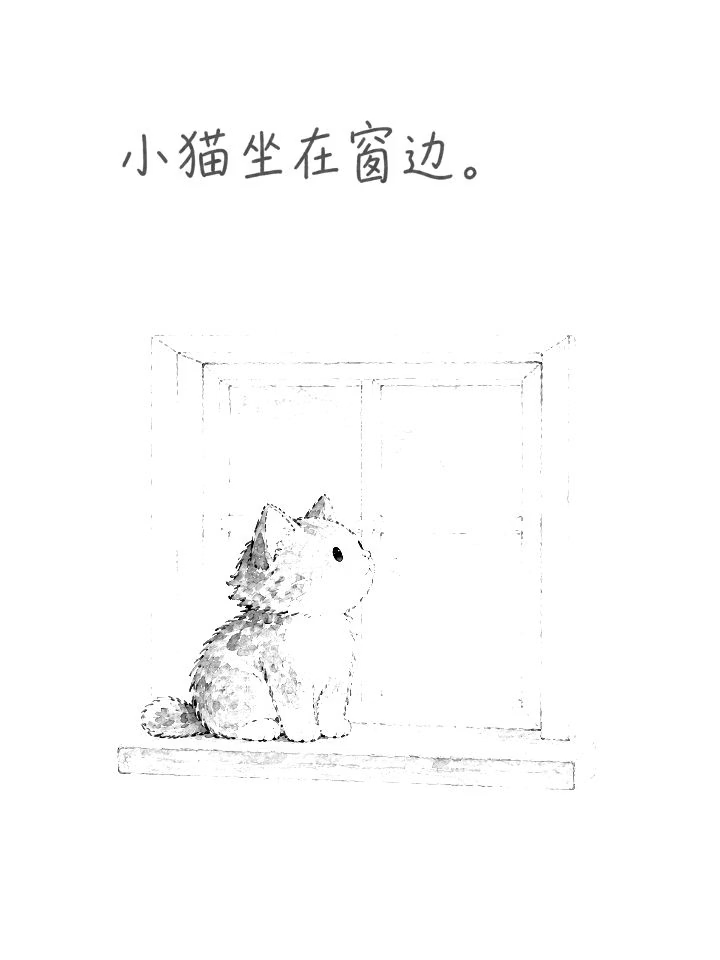
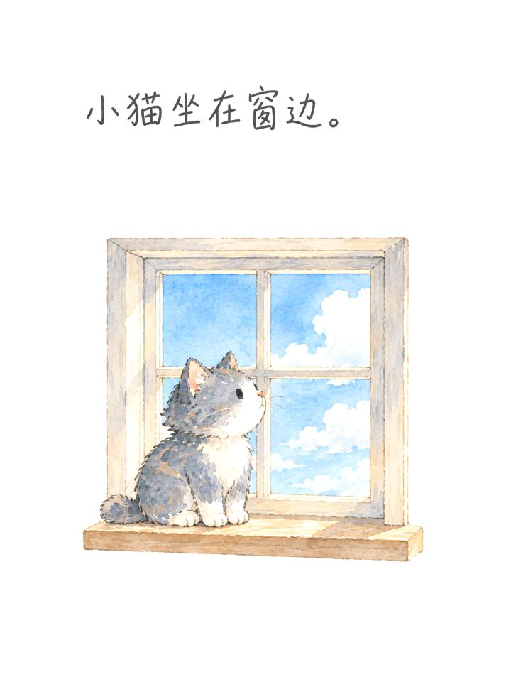

# 手绘文字与视频流程回测

日期：2026-09-22。对象：本次优化后的源码与 `skill-package/story-to-handdrawn-video/`。回测在独立的本地工作目录执行，原有两个项目分镜未被覆盖。本文保留首次视频回测的实际输入和结果；后续统一过桥配图的检查另见 [标准配图回测](standard-preview-report.md)。

## 结果

| 检查 | 结果 |
| --- | --- |
| 当时的本地图库 | 首次检查 327 / 327 可解码；随后改为统一过桥配图，最新结果见标准配图回测 |
| 资产库 | 297 条画风 + 30 种配色；默认 30 项；原有 20 项选择器与配方兼容 |
| 浏览器 | 327 张本地缩略图、30 种配色、25 条水彩分类、HS-128 搜索、站内放大/关闭、复制命令、恢复精选通过 |
| 自动化回归 | 12 / 12 通过，包含计划、参考图校验/收藏/复用、两种转场、裁切边界和导入后的严格素材校验 |
| 类型与构建 | `npm run check`、`npm run build`、dao-skill 结构检查通过 |
| 真实手绘中文字 | 两页逐字目视核对通过；使用内置生图工具绘制，没有字体叠字 |
| 真实参考风格收藏 | 已保存分析结果和参考图副本，并用 `custom:replay-watercolor` 成功规划新故事；复用步骤未再次生图 |
| 真实上传兼容 | 相同母图经上传与生成两条入口处理，两个场景的文字、黑白、彩色图 SHA-256 分别完全一致 |
| 真实视频 | 逐层绘制：9.0 秒 / 270 帧；翻页：8.3 秒 / 249 帧。两者均为 720×960、30 fps、H.264，无音轨 |

图库浏览器检查通过临时本机静态服务完成；HTML 的数据和图片路径均为本地资源，没有运行时网络依赖。内置浏览器自动化不支持直接绑定 `file://` 页面，因此未将它描述为已自动执行的文件协议测试。

## 实际输入与生成过程

故事：**小猫坐在窗边。小鸟停在枝头。**

参考图：首次回测时的 HS-128 水彩示例。Agent 实际看图，提取线条、造型、配色、材质、构图和配套手写字特征；图上的编号与说明被识别为标签，没有带进成片。该旧图已退出公共图库，原回测输入保留在本地回测材料中。现在用 [HS-128 标准配图](../references/style-examples/standard/hs-128.png) 复测时，需要重新看图分析，不能沿用旧图的校验值。

生成使用内置 `image_gen.imagegen`，模型由工具默认配置决定，未指定模型覆盖或调用 API 兜底。共生成 1 张角色参考、2 张场景初稿，再对两张初稿各编辑 1 次，共 5 次出图。场景母图为 1024×1536，最后经过共享素材处理与 Remotion 渲染。

角色锁定为灰蓝白色小猫与黄色小鸟，每页只出现原句要求的角色。生成图保留了水彩颗粒、冷暖色关系和细线手写字；动物造型比参考图更细致。本次判断是同一 Agent 的目视复核，不是独立评审，也不代表完全复刻。

## 发现的问题与修复

1. **参考图的避免项语义不够明确。** 原描述拼接后可能被当成正向绘制要求。现在每项明确加 `Avoid:`，并验证其进入生图提示词。
2. **模型未严格遵守固定分割坐标。** 初稿插画从约 y=385 / y=425 开始，机械沿 y=512 切图会丢失上方画面。现在生成图与上传图共用实际留白分隔检测；生成图无明确分隔时停止并提示修图。新增提前起画、无分隔、完整翻页不裁切等回归用例。
3. **初稿背景画到页面边缘。** 通过生图工具编辑为完整窗框 / 完整枝条的留白构图，再导入。保留原文字、角色和画材，未用程序重绘字体或伪造生图。

## 成片帧证据

以下为真实 MP4 中提取的帧。

| 文字阶段 · 1.1 秒 | 黑白阶段 · 2.3 秒 | 彩色阶段 · 4.0 秒 | 翻页中段 · 4.15 秒 |
| :---: | :---: | :---: | :---: |
|  |  |  |  |

本次本地输出位于 `out/replay/`：

- `handwritten-cut-preview.mp4`：逐层绘制样片。
- `handwritten-page-flip-preview.mp4`：完整母图翻页样片。
- `masters/`：角色参考与两张最终母图。
- `imagegen-prompts.json`：实际生成及修图提示词、工具模式。
- `storyboard.cut.json`、`storyboard.flip.json`：已使用的分镜。
- `cut-metadata.json`、`page-flip-metadata.json`：FFprobe 视频参数。

视频和任务日志保留在本次本地工作区，不随源码分享包分发；上面的四张帧证据随 `examples/` 分发。

## 复测命令与证据边界

```bash
npm run check
npm run build

# 生图需要 Agent 实际看图、分析并调用工具；generate 不是出图完成
python3 scripts/run_story_video.py \
  --text '小猫坐在窗边。小鸟停在枝头。' \
  --style-reference references/style-examples/standard/hs-128.png --mode generate

# Agent 写完 profile、生成并放置母图后：
python3 scripts/run_story_video.py --mode import
python3 scripts/run_story_video.py --mode preview
```

静态数据、兼容性、共享素材路径及真实预览渲染达到已执行证据（E3）；视频视觉判断来自本次两页样本。未执行全部 297 条画风的连续视频质量评测、长篇叙事连续性评测、API 兜底生图或 1080×1440 正式视频渲染。后续标准配图是单张画风比较样本，不能替代逐场景文字和视频质量复核。

此回测执行时只更新本地项目，未全局安装。此前整体优化基线为 `fbab5b2`。后续发布包含本报告；回滚应只恢复本次范围内的文件，并保留用户 `.story-video/` 与其他运行产物，不要用整库清理覆盖无关改动。
